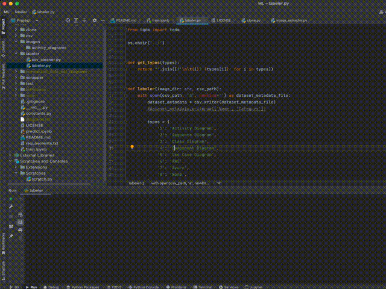

# An analysis of diagram images on Git repositories

The next project contains multiple tools to extract and process data from repositories, helping in repository mining tasks.

### **Topics:**

* [Git clone](clone/clone.py)
* [Labeler](labeling/labeler.py)
* [Image Scrapper](scrapper/scrapper.py)
* [Normalizer](scrapper/normalizer.py)
* [Training notebook](train.ipynb)
* [Prediction notebook](predict.ipynb)

---

## Instructions

We recommend to install an external environment, you can find more info in
the [documentation](https://docs.python.org/3/tutorial/venv.html).

```
python -m venv ML-env
```

Install dependencies described in the [requirements.txt](requirements.txt) file,
and make sure you have the correct version of tensorflow according to your CPU architecture.

```
python -m pip install -r requirements.txt
```

---

## Git clone

This module is useful to clone and extract info form multiple Git repositories, we use two datasets
Lindholmen and GHTorrent, but you can adapt the code to any CSV with a list of repositories.

## Labeler

This module is a helper tool to label images in a dataset, using opencv library we show every image in a folder, and you
can input any key in the keyboard to map the category assign to that image



```
python labeler.py
```

## Scrapper

The scrapper is a tool that uses selenium to search images in _Google images_ and download them in your
local desktop, set the term to search for inside the script and run it!


```
python scrapper/scrapper.py
```

## Normalizer

This is a normalizer script to preprocess images, the output images are in format RGB with size 224x224 pixels and are 
named from a hash generated from the image content.

```
python scrapper/normalizer.py
```

## Training notebook

Go to the jupyter file and run the notebook, it shows the process to train a convolutional neural network for image 
classification applying the transfer learning technique.

## Prediction notebook

Go to the jupyter file and run the notebook, it shows the prediction process in batches for large datasets.
